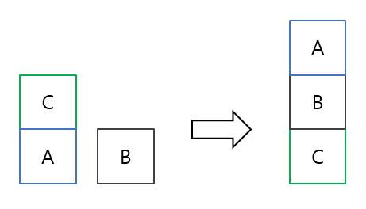
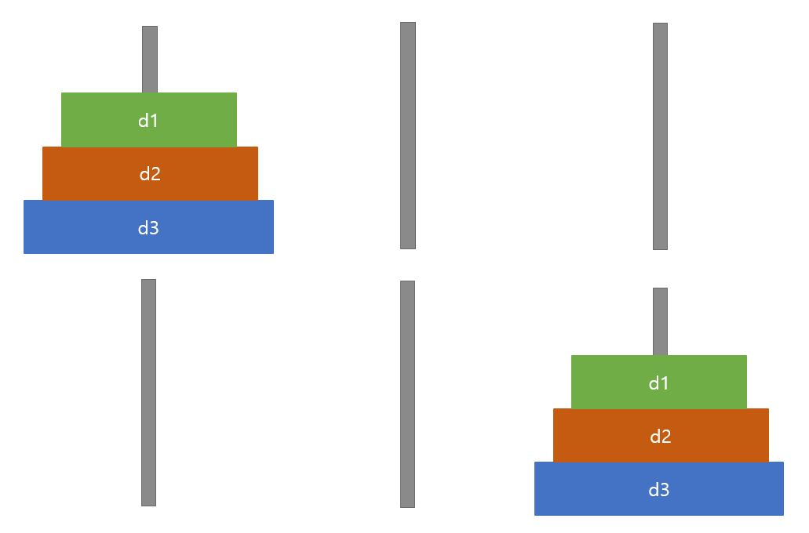

# STRIPS-PDDL

Description
-----------
STRIPS is planning method and PDDL(Planning Domain Definition Language) is an attempt to standardize Artificial Intelligence (AI) planning languages. 

Some problems were solved using PDDL.

You can plan through the PDDL editor.

See [here](http://users.cecs.anu.edu.au/~patrik/pddlman/writing.html).

How to run
-----------

You can take [this link](http://editor.planning.domains/) and run the pddl file. 

From the File menu, click the load button to load the domain and problem files. 
Then press the solve button, select the domain and problem files, and press the solve button. 

Blocks world
------------

You have to move the block with your robot arm to solve the problem. 
The initial state and target state are as follows. 

Hanoi of tower
-------------

Let p1, p2, p3 be the columns from the left, and all of the disks are stacked on p1 in turn.  
You should plan to move all the disks to p3 with STRIPS.

